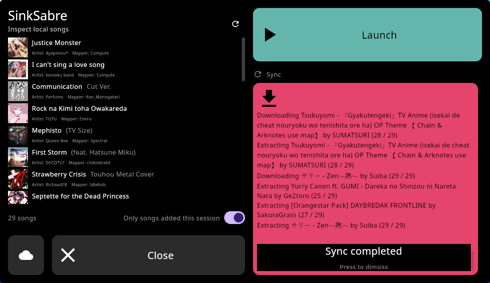
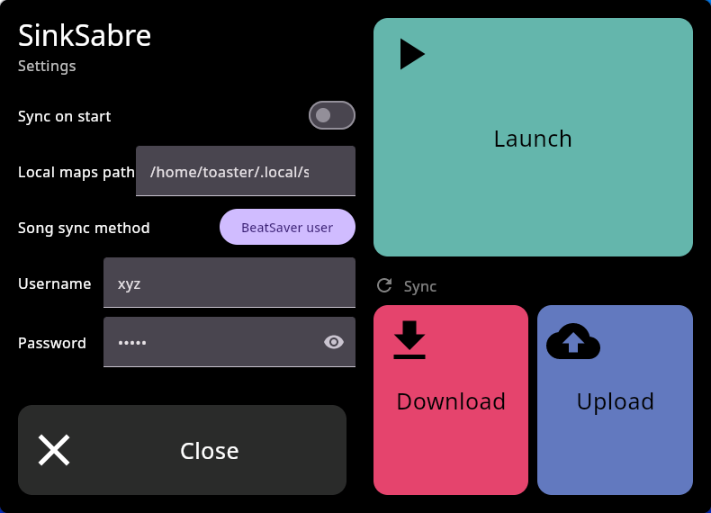

# SinkSabre

An alternative to the (recently removed) Beat Saber sync function provided by BMBF and BeastSaber for ~~Meta~~ Oculus Quest.

This is a [Compose Multiplatform](https://github.com/JetBrains/compose-multiplatform) application, and supports both **direct install to Quest** and **running on desktop** (tested on Linux only, but Windows should work in theory).

## Features
- Upload to and download from several sources:
    - BeatSaver account bookmarks
    - BeatSaver playlists
- (Mostly) VR-friendly interface
- Launch Beat Saber from within application
- View maps added in the current session
- View local maps
- View bookmarked maps

> [!NOTE]
> BeatSaver accounts registered using Discord cannot be used. Sync using a playlist instead.

## Installation

### Quest / Android

1. Download the appropriate APK for your device from the [releases page](https://github.com/toasterofbread/sinksabre/releases)
2. Install using ADB or Sidequest

### Desktop

A binary release for desktop platforms is not currently provided.

The desktop application can be started from the project source code using the `desktopApp:run` Gradle task.

## Screenshots

